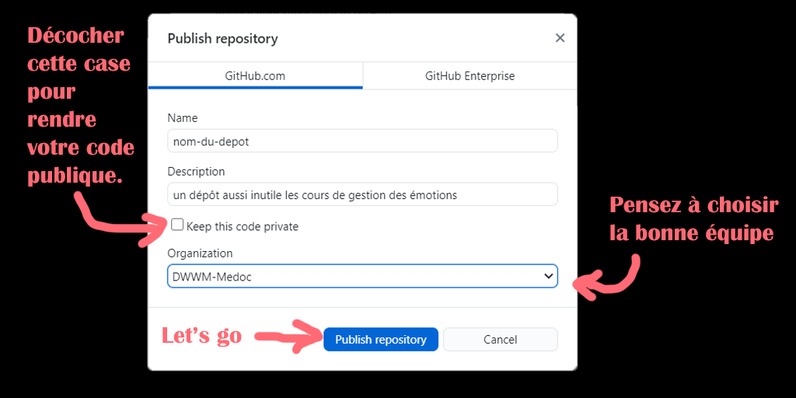
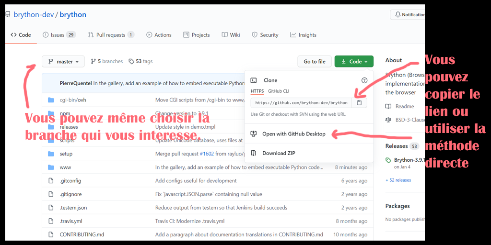
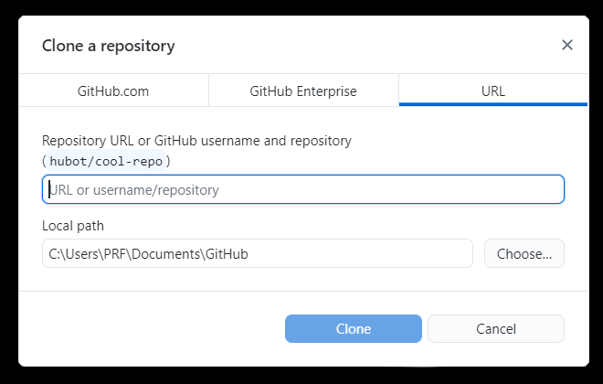

# Tuto Github Desktop + Visual Studio Code #

<h2>0. Introduction.</h2>

J'écris ce petit tuto pour ceux qui ne seraient pas très familiers avec l'utisation de Github.
Je partage avec vous mon workflow, il m'est propre mais est relativement simple à mettre en place et à utiliser (*Et il devrait convenir à ceux d'entre vous qui êtes alergiques aux terminaux*).

<h2>1. Installation de Github Desktop.</h2>

Rendez-vous sur le site de [GitHub Desktop](https://desktop.github.com) puis télécharger le fichier correspondant à votre système d'exploitation.
Une fois le fichier téléchargé, exécutez-le, vous devriez voir apparaître une fenêtre vous demandant de vous connecter à votre compte Github.

Connectez-vous en associant au passage l'application Github Desktop aux liens github (*ça sert toujour*).

Enfin vous pouvez choisir un nom d'affichage différent de votre nom d'utilisateur si vous le voulez

Et TADAAA ! C'était pas si dur (*le fun viens après*)

<h2>2. Créer un dépôt.</h2>

Bon si vous êtes arrivé jusque là ce n'est pas le moment de paniquer, c'est relativement simple.
Github Desktop vous permet de créer, mettre à jour et cloner des dépôts tout en interface graphique (*et quelle interface non mais sérieusement c'est esthétique !*).

Il vous suffit de cliquer sur fichier => nouveau dépôt

Ensuite une fenêtre vous permettant de régler les différents paramètre va apparaîte *WHOOSH*

Une fois crée vous allez arriver sur l'interface du logiciel (*là aussi rien de bien méchant*).

<h2>3. Publier un dépôt.</h2>

Si vous cliquez sur "publier le dépôt", vous arriverez sur la page suivante qui vous permettra de configurer votre dépôt.

Voilà ! Vous savez tout ce qu'il y a à connaître pour créer un dépôt partagé (*toujour vivant ?*)

<h2>4. Cloner un dépôt.</h2>

Nous allons maintenant voir comment réaliser l'opération inverse, c'est à dire récupérer un dépôt déjà en ligne sur Github pour le synchroniser sur votre PC.
Pour cela il vous suffit de cliquer sur **Fichier** => **Clone Repository** vous ferez ensuite face à une fenêtre contenant la liste de vos dépôts.

Vous pouvez aussi cloner depuis le site (*vu qu'on a associé les liens Github à l'application Desktop vous vous souvenez*)

Il ne vous reste plus qu'à définir l'emplacement local et à cloner le dépôt de votre choix.
Un autre alternative consiste à cloner un dépôt en renseignant son URL.

Nous avons maintenant fait le tour des méthodes pour créer et cloner un dépôt, vous êtes maintenant prêt **à coder du sal**.

