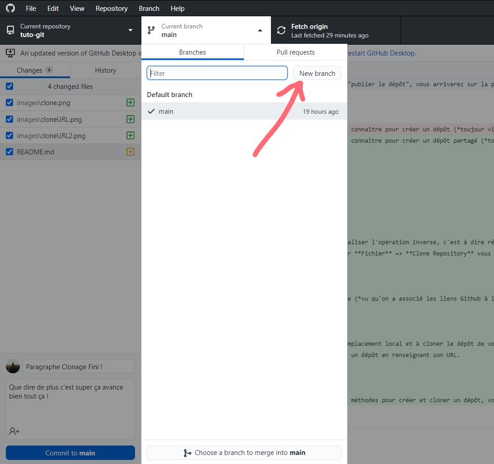
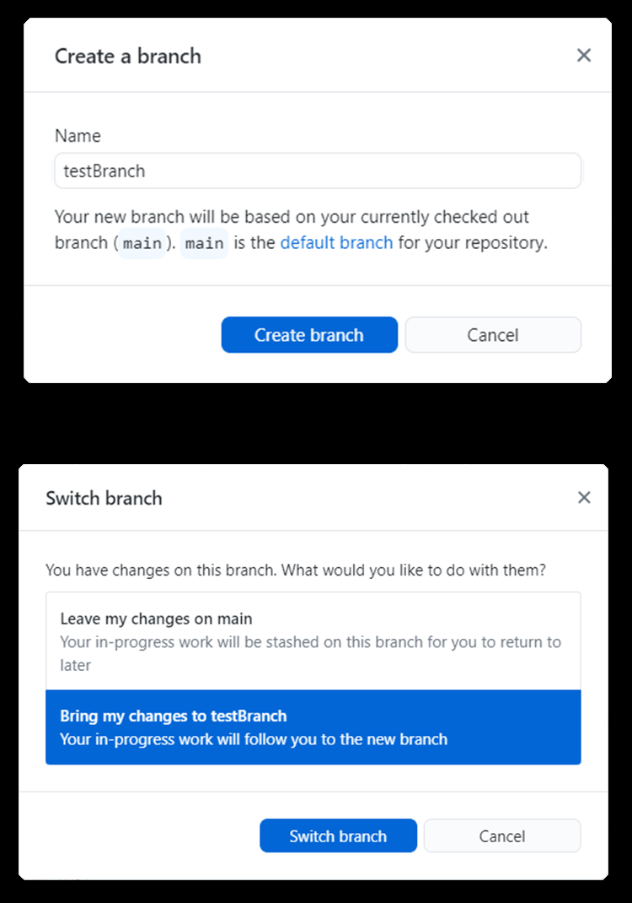
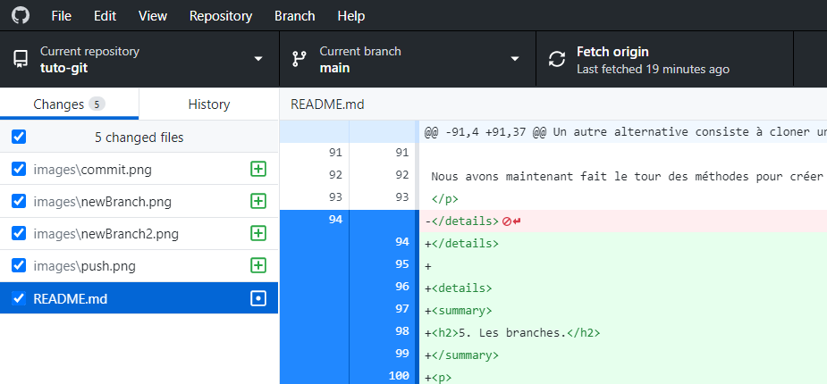
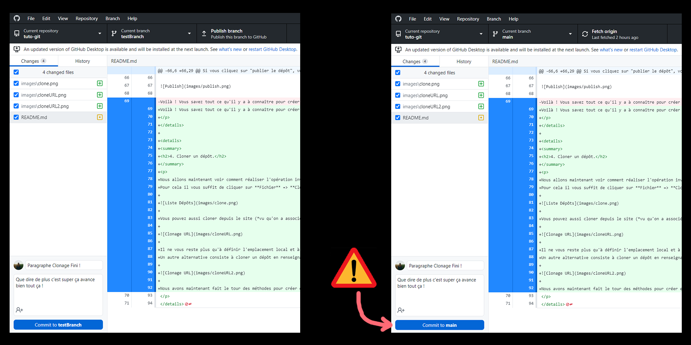
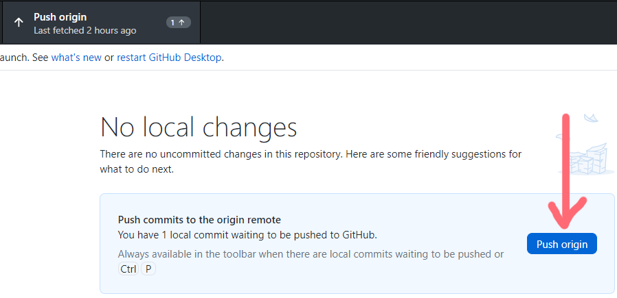
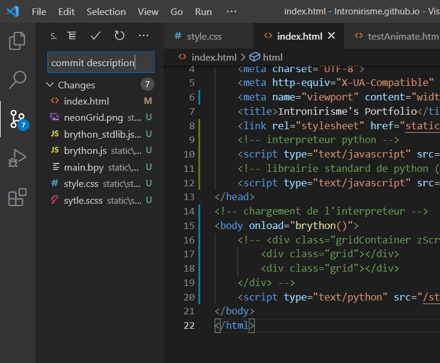

# Tuto Github Desktop #

<h2>0. Introduction.</h2>

J'écris ce petit tuto pour ceux qui ne seraient pas très familiers avec l'utisation de Github.
Je partage avec vous mon workflow, il m'est propre mais est relativement simple à mettre en place et à utiliser (*Et il devrait convenir à ceux d'entre vous qui êtes alergiques aux terminaux*).

<h2>1. Installation de Github Desktop.</h2>

Rendez-vous sur le site de [GitHub Desktop](https://desktop.github.com) puis télécharger le fichier correspondant à votre système d'exploitation.
Une fois le fichier téléchargé, exécutez-le, vous devriez voir apparaître une fenêtre vous demandant de vous connecter à votre compte Github.

Connectez-vous en associant au passage l'application Github Desktop aux liens github (*ça sert toujour*).

Enfin vous pouvez choisir un nom d'affichage différent de votre nom d'utilisateur si vous le voulez

Et TADAAA ! C'était pas si dur (*le fun viens après*)

<h2>2. Créer un dépôt.</h2>

Bon si vous êtes arrivé jusque là ce n'est pas le moment de paniquer, c'est relativement simple.
Github Desktop vous permet de créer, mettre à jour et cloner des dépôts tout en interface graphique (*et quelle interface non mais sérieusement c'est esthétique !*).

Il vous suffit de cliquer sur fichier => nouveau dépôt

Ensuite une fenêtre vous permettant de régler les différents paramètre va apparaîte *WHOOSH*

Une fois crée vous allez arriver sur l'interface du logiciel (*là aussi rien de bien méchant*).

<h2>3. Publier un dépôt.</h2>

Si vous cliquez sur "publier le dépôt", vous arriverez sur la page suivante qui vous permettra de configurer votre dépôt.

Voilà ! Vous savez tout ce qu'il y a à connaître pour créer un dépôt partagé (*toujour vivant ?*)

<h2>4. Cloner un dépôt.</h2>

Nous allons maintenant voir comment réaliser l'opération inverse, c'est à dire récupérer un dépôt déjà en ligne sur Github pour le synchroniser sur votre PC.
Pour cela il vous suffit de cliquer sur **Fichier** => **Clone Repository** vous ferez ensuite face à une fenêtre contenant la liste de vos dépôts.

Vous pouvez aussi cloner depuis le site (*vu qu'on a associé les liens Github à l'application Desktop vous vous souvenez*)

Il ne vous reste plus qu'à définir l'emplacement local et à cloner le dépôt de votre choix.
Un autre alternative consiste à cloner un dépôt en renseignant son URL.

Nous avons maintenant fait le tour des méthodes pour créer et cloner un dépôt, vous êtes maintenant prêt **à coder du sal**.

<h2>5. Les branches.</h2>

Pour synchroniser votre travail avec Github, l'opération s'appelle **Push**

Lors d'un Push, git (*le programme gérant le contrôle de version, pas github*) va comparer le dossier local au dépôt Github distant et réécrire sur le dépôt Github les éléments ayant subit des modification.
C'est très efficace, on ne re-upload pas l'ensemble du projet à chaques fois ce qui est pratique quand on a une connexion de babouin comme la mienne seulement il y a un mais.
Supposons que M. A et Mr. B travaillent ensemble sur un projet :

- M. A clone le dépôt et commence à travailler sur ce que nous appelerons la **version 1** du projet
- Mr. B fait pareil de son côté il possède aussi la **version 1**
- M. A a bien avancé sur le programme et décide d'envoyer sont travail (**version 2.A**) sur Github
- Le dépôt Github à été mis à jour et contiens bien la **version 2.A** super, on rentre chez nous !
- Mr. B a terminé son travail aussi et a crée une **version 2.B** qui envoie sur Github
-Le dépôt Github à été mis à jour et demain M. A risque de s'apercevoir demain qu'une partie de son travail a été remplacé

Pour éviter ce genre de problèmes, Github a mis en place un système de branches, chacun peut ainsi créer sa propre version du projet, y apporter des modifications et la personne en charge du projet va pouvoir fusionner les branches une fois revues et validés.
Je ne saurais que vous conseiller d'utiliser cette fonctionnalité, surtout lorsque vous travaillez sur des scripts pour éviter les conflits entre les ajouts des uns et des autre ou pour éviter de saboter l'ensemble du projet à cause d'un **;** manquant ou d'une fonctionnalité inachevée.
Pour créer une branche rien de plus simple et une image valant mille mots, et bien voilà deux-mille mots.

Vous pourrez par la suite utiliser cet onglet pour changer de branche à tout moment, il ne me reste plus qu'à vous montrer les opération **Pull** et **Push**.

<h2>6. Pull</h2>

Avant de commencer à travailler, il vous faut vous assurer que la version du projet sur votre PC correspond bien à la dernière version en ligne sur Github.
Pour cela l'opération à effectuer s'appelle un **Pull**, et c'est extrêmement simple.

C'est tout mais il vaut mieux le savoir !

<h2>7. Push</h2>

Nous avons déjà mentionné le **Push** dans la section consacrée aux branches, vous savez ce dont il s'agit, il ne reste plus qu'à vous montrer comment faire un push.
Tout d'abord, vous effectuer un **Commit** pour décrire les modifications apportés au projet par rapport à la dernière version.

Enfin il ne vous reste plus qu'à cliquer sur **Push origin** pour uploader vos modifications aux serveurs de Github.

Et dernière petite astuce, il est aussi possible d'effectuer un push directement depuis Visual Studio (de nombreux IDE incluent cete fonctionnalité).

Et voilà vous avez tout les rudiments pour pouvoir commencer à utiliser Github en tout simplicité !

by Intronirisme